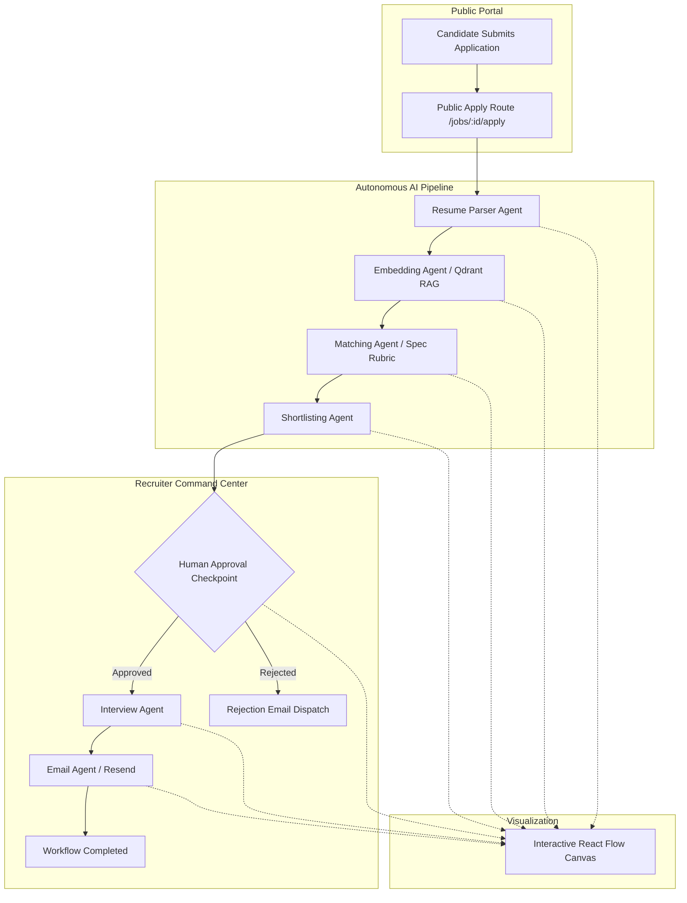

<div align="center">

# 🤖 AgenticHire.AI
### Enterprise Spec-Driven Multi-Agent AI Recruitment & ATS Platform

[](https://github.com/manikanta-2310/AgenticHireAI/actions/workflows/ci.yml)
[](https://nextjs.org/)
[](https://expressjs.com/)
[](https://langchain.com/)
[](https://mongodb.com/)
[](https://qdrant.tech/)
[](https://tailwindcss.com/)
[](https://reactflow.dev/)

<p align="center">
  <strong>An autonomous ATS platform where candidates apply publicly, AI agents evaluate resumes with RAG intelligence, and recruiters monitor & approve decisions on an interactive canvas.</strong>
</p>

<p align="center">
  🌐 <strong>Live Demo:</strong> <a href="https://agentic-hire-ai-lake.vercel.app" target="_blank"><strong>agentic-hire-ai-lake.vercel.app</strong></a> &nbsp;|&nbsp; 
  ⚡ <strong>Backend API:</strong> <a href="https://agentichireai-oe83.onrender.com/health" target="_blank"><strong>agentichireai-oe83.onrender.com</strong></a>
</p>

[Key Features](#-key-features) • [Architecture](#-system-architecture) • [Multi-Agent Pipeline](#-multi-agent-pipeline) • [Quick Start](#-quick-start) • [Deployment](#-deployment-guide)

</div>

---

## 🌟 Highlights & Philosophy

Unlike traditional chatbots or static ATS tools, **AgenticHire.AI** is built on two core principles:

1. **100% Spec-Driven Business Logic**:
   - **Zero hardcoding**. Hiring thresholds, evaluation rubrics, scoring weights, retry policies, email templates, and agent prompts are loaded dynamically from `/specs`.
2. **Autonomous Multi-Agent Orchestration with Human-in-the-Loop**:
   - 6 specialized AI agents execute in sequence with state persistence, automatic failure recovery, and an interactive recruiter approval gate.

---

## 🔄 System Architecture



---

## 🤖 Multi-Agent Pipeline

| Agent | Core Responsibility | Output / Artifact |
| :--- | :--- | :--- |
| **1. Resume Parser Agent** | Extracts structured biographical, skill, and experience data from PDF/text resumes | Standardized JSON profile |
| **2. Embedding Agent** | Chunks resume data (500 chars) and generates 384-dim dense vectors into Qdrant | Vector embeddings & collection index |
| **3. Matching Agent** | Compares candidate against dynamic hiring specs using RAG organizational context | Match Score (0–100%) & category breakdown |
| **4. Shortlisting Agent** | Evaluates score against spec thresholds (Shortlist $\ge$ 80, Hold 60–79, Reject < 60) | Stage decision & approval trigger |
| **5. Human Approval Gate** | Pauses workflow for recruiter review with real-time UI controls | Approved / Rejected status |
| **6. Interview Agent** | Generates customized technical interview questions, grading rubrics, and coding tasks | Interview pack JSON |
| **7. Email Agent** | Dispatches status invitations or updates via Resend API / simulation | Delivered email notification |

---

## 📁 Project Structure

```
ai-recruitment-platform/
│
├── client/                      # Next.js 15 App Router (JavaScript)
│   ├── app/
│   │   ├── dashboard/           # Recruiter Command Center (Jobs, Candidates, Workflows, Analytics)
│   │   ├── (auth)/              # Recruiter Sign In & Registration
│   │   ├── jobs/                # Public Job Listings Directory
│   │   └── jobs/[jobId]/apply/  # Public Candidate Application & Live AI Tracker
│   ├── components/              # React Flow Canvas, Navbar, Sidebar, Badges, StatCards
│   ├── store/                   # Zustand auth & workflow state stores
│   └── lib/api.js               # API client wrapper
│
├── server/                      # Modular Express.js Backend (JavaScript)
│   ├── src/
│   │   ├── config/              # MongoDB, Qdrant vector store, & SpecLoader
│   │   ├── agents/              # 6 Autonomous AI Agent implementations
│   │   ├── workflows/           # LangGraph workflow engine with retries & checkpoints
│   │   ├── rag/                 # BGE embeddings & Qdrant similarity search
│   │   ├── models/              # Mongoose schemas (User, Job, Candidate, Workflow, Logs)
│   │   ├── controllers/         # Express route handlers
│   │   └── routes/              # Express API endpoints
│   ├── uploads/                 # Uploaded candidate resumes
│   ├── logs/                    # Workflow execution traces & audit logs
│   └── tests/                   # Jest automated agent & rubric unit tests
│
├── specs/                       # Source of Truth Specifications
│   ├── hiring/                  # Role requirements & passing thresholds
│   ├── workflow/                # Node configurations & execution order
│   ├── evaluation/              # Scoring rubrics & component weights
│   ├── prompts/                 # Deterministic LLM agent prompt templates
│   ├── email/                   # Candidate status email templates
│   └── system/                  # Retry policies & error classifications
│
└── docker-compose.yml           # Local MongoDB & Qdrant container orchestration
```

---

## ⚡ Quick Start

### Prerequisites
- **Node.js**: v20+
- **MongoDB**: Local instance or free MongoDB Atlas cluster
- **Docker** *(Optional)*: For local Qdrant vector database

---

### 1. Configure Environment Variables

**Backend (`server/.env`):**
```env
PORT=5000
MONGODB_URI=your_mongodb_connection_string/agentic_hire?appName=Cluster0
JWT_SECRET=your_jwt_secret_token
GROQ_API_KEY=your_groq_api_key_optional
OPENROUTER_API_KEY=your_openrouter_api_key_optional
QDRANT_URL=http://localhost:6333
RESEND_API_KEY=your_resend_api_key_optional
NODE_ENV=development
```

**Frontend (`client/.env.local`):**
```env
NEXT_PUBLIC_API_URL=http://localhost:5000
```

---

### 2. Install & Start Backend

```bash
cd server
npm install
npm run seed     # Seeds demo recruiter, jobs, and executes first sample workflow
npm run dev      # Server starts on http://localhost:5000
```

### 3. Install & Start Frontend

```bash
cd client
npm install
npm run dev      # Frontend starts on http://localhost:3000
```

---

## 🧪 Testing the Application Locally

1. **Recruiter Portal**:
   - Open `http://localhost:3000/login`
   - Default login credentials:
     - **Email:** `recruiter@agentic.ai`
     - **Password:** `password123`
2. **Candidate Application**:
   - Open `http://localhost:3000/jobs`
   - Click **"Apply Now"** on any job posting
   - Click **"Use Sample Resume"** (1-Click Test) or drag-and-drop a PDF
   - Submit to watch the autonomous AI pipeline execute in real time.
3. **Workflow Visualizer**:
   - Open `http://localhost:3000/dashboard/workflows`
   - Observe real-time node transitions on the **React Flow Canvas**:
     - 🔵 **Blue Pulse:** Running
     - 🟢 **Green:** Success
     - 🟡 **Yellow Pulse:** Paused for Recruiter Approval
     - 🔴 **Red:** Failed
   - Click **"Approve & Schedule"** to resume the workflow.

---

## 🛰️ API Reference

### Authentication
- `POST /auth/signup` — Register new recruiter
- `POST /auth/login` — Recruiter login (JWT token)
- `GET /auth/me` — Current user profile

### Jobs & Specifications
- `GET /jobs` — List all active job postings (Public)
- `GET /jobs/:id` — Get single job details (Public)
- `POST /jobs` — Create new job linked to a spec (Protected)
- `GET /specs/hiring` — List available dynamic hiring specs (Public)

### Candidates & Applications
- `POST /candidates/upload` — Public candidate resume upload & workflow trigger
- `GET /candidates` — List all candidates with match scores (Protected)
- `GET /candidates/:id` — Candidate profile with generated interview pack (Protected)

### Workflows & Human Checkpoints
- `GET /workflow/:id` — Workflow state & node execution statuses
- `POST /workflow/approve` — Recruiter approval checkpoint action (`approve` / `reject`)
- `POST /workflow/retry` — Retry failed workflow node

---

## 🚢 Deployment Guide

### Deploying the Backend (Render / Railway / DigitalOcean)
1. Push this repository to GitHub.
2. Create a new **Web Service** on [Render](https://render.com) or [Railway](https://railway.app).
3. Set **Root Directory** to `server`.
4. Set **Build Command** to `npm install`.
5. Set **Start Command** to `npm start`.
6. Add environment variables (`MONGODB_URI`, `JWT_SECRET`, etc.).

### Deploying the Frontend (Vercel)
1. Import the repository on [Vercel](https://vercel.com).
2. Set **Root Directory** to `client`.
3. Set **Environment Variable**: `NEXT_PUBLIC_API_URL` to your deployed backend URL.
4. Click **Deploy**.

---

## 📄 License
This project is licensed under the [ISC License](LICENSE).
